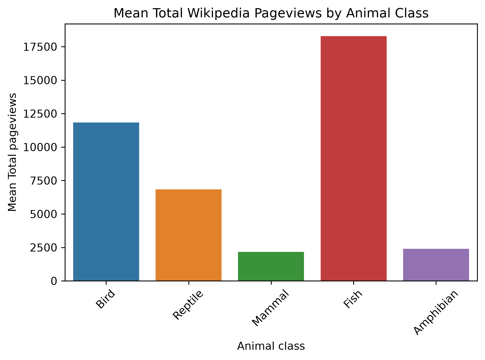
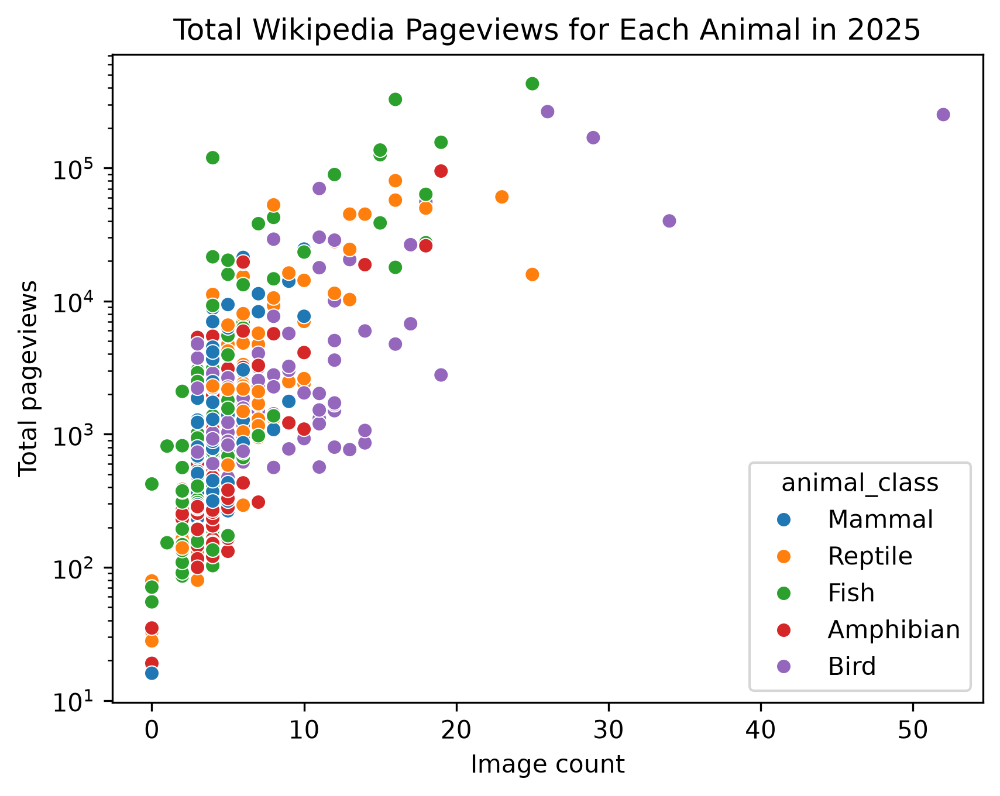
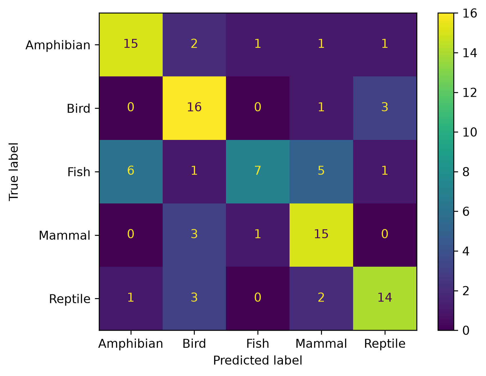
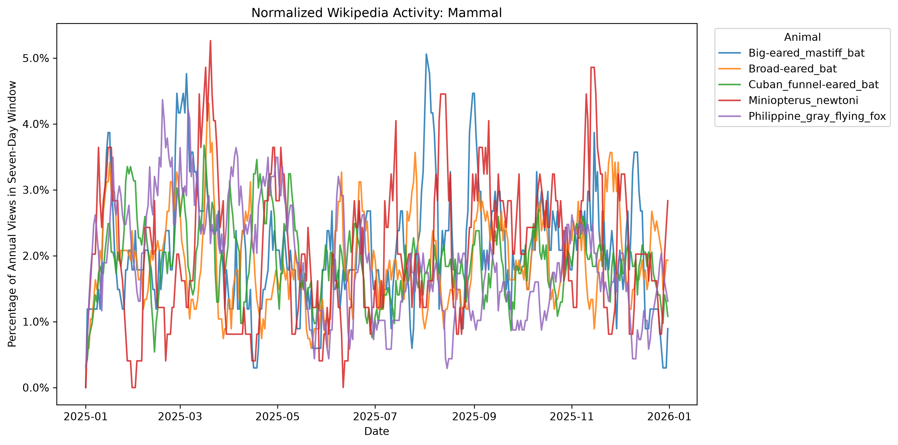
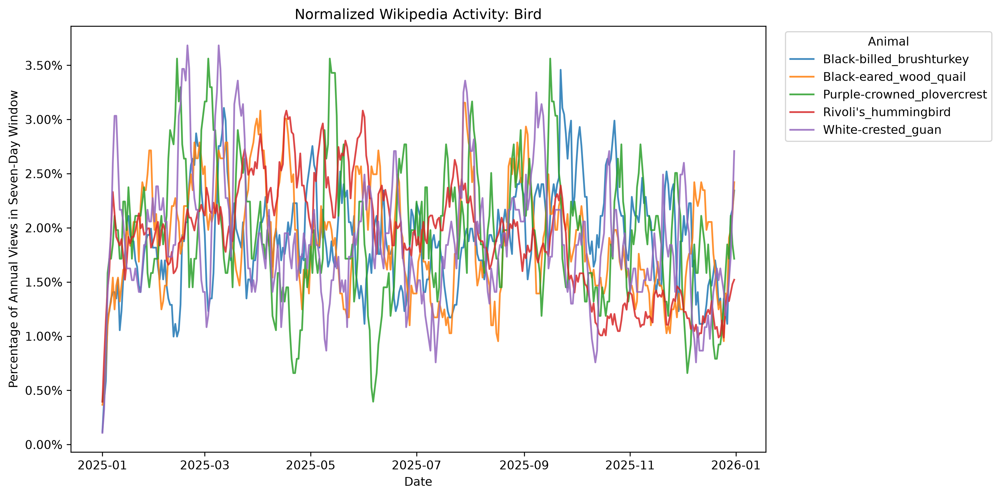
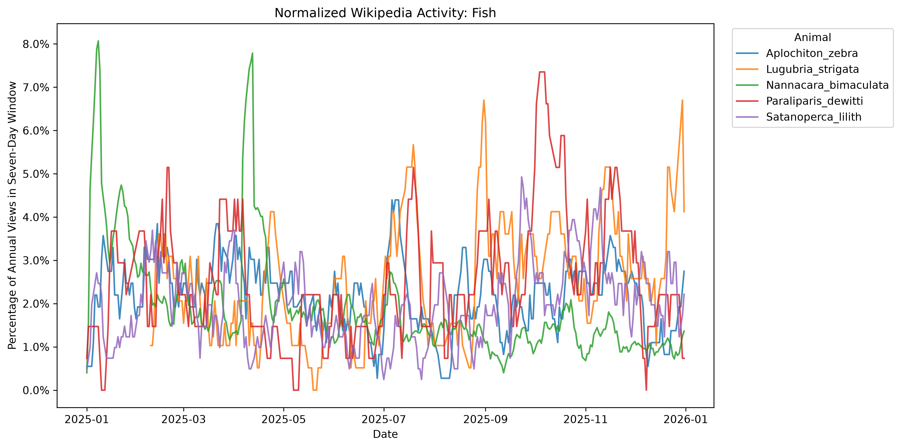
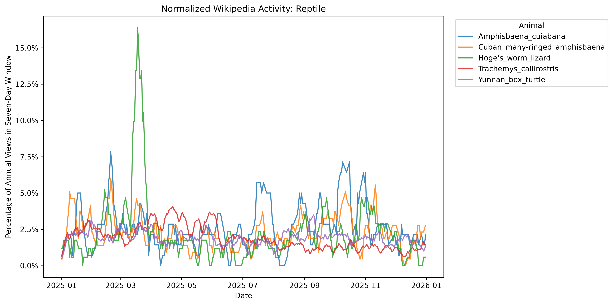
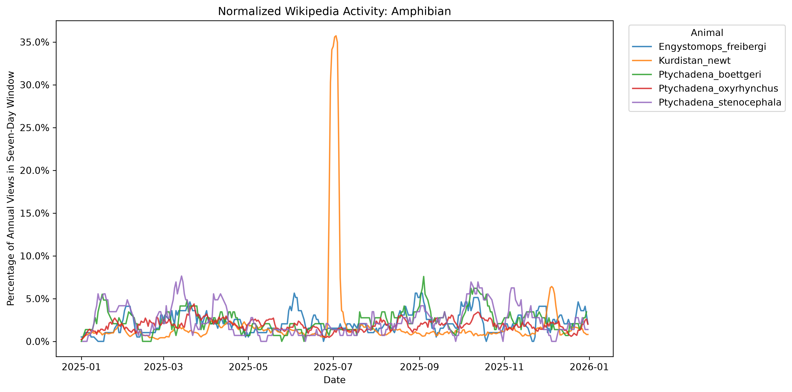

# Wikipedia Animal Pageview Analysis

## Overview

This project investigates the differences in Wikipedia activity among animal classes, and whether the activity is enough to predict which class an animal belongs to. It combines daily Wikipedia pageviews, taxonomic information obtained from Wikidata, and the number of images embedded in each article.

The project trains a machine-learning classifier to predict an animal’s class from its pageview history over the course of a year.

## Research Questions

* Which animal classes receive the most Wikipedia traffic?
* How does pageview activity vary throughout the year?
* Do different animal classes exhibit different temporal viewing patterns?
* Is the number of images associated with an article’s popularity?
* Can an animal’s class be predicted from its pageview history?

## Animal Groups

The dataset contains species from five groups:

* Mammals
* Birds
* Reptiles
* Amphibians
* Fish

For this project, fish are defined as ray-finned fishes and cartilaginous fishes. Lobe-finned fishes were excluded to avoid including terrestrial vertebrates through their shared taxonomic ancestry.

Only Wikidata entries that:

1. Are identified as taxa
2. Have species as their taxonomic rank
3. Belong to one of the selected animal groups
4. Have an English Wikipedia article

were included.

## Data Sources

* [Wikidata Query Service](https://query.wikidata.org/) — species names, taxonomic classification, and English Wikipedia page titles
* [Wikimedia Pageviews API](https://doc.wikimedia.org/generated-data-platform/aqs/analytics-api/reference/page-views.html) — daily article pageviews
* [MediaWiki Images API](https://www.mediawiki.org/wiki/API:Images) — media files embedded in each article

## Variables

| Variable          | Description                                   |
| ----------------- | --------------------------------------------- |
| `page_title`      | English Wikipedia article title               |
| `animal_class`    | Mammal, bird, reptile, amphibian, or fish     |
| `date`            | Date of the pageview observation              |
| `pageviews`       | Number of pageviews on that date              |
| `total_pageviews` | Total pageviews across the selected year      |
| `image_count`     | Number of media files embedded in the article |

The image count can include photographs, maps, diagrams, icons, and images included through templates. It should therefore be interpreted as an embedded-media count rather than strictly as a count of animal photographs.

## Project Structure

```text
wikipedia-animals-data-science-demo/
├── data/
│   ├── raw/
│   └── processed/
├── notebooks/
│   ├── 01_data_collection.ipynb
│   └── 02_exploration_and_modeling.ipynb
├── reports/
│   └── figures/
│       ├── mean_pageviews_by_class.png
│       ├── images_vs_pageviews_log.png
│       ├── confusion_matrix.png
│       ├── time_pattern_mammal.png
│       ├── time_pattern_bird.png
│       ├── time_pattern_fish.png
│       ├── time_pattern_reptile.png
│       └── time_pattern_amphibian.png
├── README.md
├── requirements.txt
└── .gitignore
```

### Notebooks

* `01_data_collection.ipynb` queries Wikidata and Wikimedia APIs, cleans the results, and saves the processed tables.
* `02_exploration_and_modeling.ipynb` explores the data, creates visualizations, trains the classification model, and evaluates its performance.

## Analysis

The exploratory analysis includes:

* Total and median pageviews by animal class
* Rankings of the most-viewed animal pages
* Pageview activity over time
* Seven-day rolling pageview activity
* Normalized activity curves showing the shape of each animal’s viewing history
* The relationship between image count and pageviews

For normalized activity plots, each daily pageview count is divided by that animal’s total annual pageviews. This makes it possible to compare the shapes of viewing histories without overall popularity dominating the graph.

## Machine-Learning Model

The project treats animal-class prediction as a multiclass classification problem.

### Inputs

* Daily pageviews for each date in the selected year
* Number of embedded images

### Target

* Animal class

The pageview features are transformed using:

```python
X = np.log1p(X)
```

This reduces the influence of extremely popular pages.

The data is divided into training and test sets using a stratified split, ensuring that each animal appears in only one set. A random-forest classifier is compared against a baseline classifier that always predicts the most common class.

### Evaluation

Model performance is evaluated using:

* Accuracy
* Balanced accuracy
* Precision
* Recall
* F1-score
* Confusion matrix

## Key findings

### Wikipedia popularity differs by animal class



Fish had the highest mean number of pageviews in this sample, followed by
birds and reptiles. However, the pageview distributions were highly skewed:
a small number of popular pages substantially increased the class averages.
Birds had the highest median pageview total.

This distinction shows why both averages and distributions should be
considered when comparing online popularity.

### Pages with more images tend to receive more views



The scatterplot compares each article's image count with its total 2025
pageviews. A logarithmic pageview axis makes both low-traffic and high-traffic
articles visible on the same graph.

Image count and total pageviews had a Spearman correlation of approximately
0.755, indicating a strong positive association. This does not necessarily
mean that adding images causes more views: popular or extensively developed
articles may also be more likely to contain many images.

### Predicting animal class from pageview history

A random forest classifier was trained using each animal's daily Wikipedia
pageview history. The data was divided into stratified training and test sets
so that each animal class was represented in both sets.

The model achieved:

- Accuracy: **67.7%**
- Balanced accuracy: **67.8%**
- Most-frequent-class baseline accuracy: **20.2%**



The confusion matrix shows which classes the model distinguished successfully
and which it confused. Birds, mammals, amphibians, and reptiles had test-set
recall values between 70% and 80%. Fish had 78% precision but only 35% recall,
meaning that fish predictions were often correct, but many actual fish were
classified as another group.

These results suggest that the shape of an article's viewing history contains
information associated with its animal class, although it is not sufficient
for consistently accurate classification.

### Seasonal viewing patterns

The following plots show the seven-day rolling share of annual pageviews for
five sampled animals from each class. Dividing daily views by an animal's
annual total emphasizes the shape and timing of its activity rather than its
overall popularity.

#### Mammals



#### Birds



#### Fish



#### Reptiles



#### Amphibians



The normalized plots reveal short-lived spikes and seasonal patterns that
would be difficult to see using raw pageview totals. These changes may be
connected to news stories, holidays, migrations, breeding seasons, media
appearances, or other events.  For instance many mammals are bats, whose 
views will likely spike at the start of caving seasons.

## Limitations

* Wikipedia traffic reflects public attention, not the biological importance or abundance of a species.
* Pageviews can be affected by news, films, television, viral events, school assignments, and ambiguous article names.
* The sampled species may not represent all species within each animal class.
* Wikidata’s taxonomy is collaboratively maintained and may contain incomplete or inconsistent ancestry information.
* Image count includes all embedded media, not only photographs of the animal.
* Article popularity may cause editors to add images, so a relationship between images and pageviews should not be interpreted as causal.
* The model may learn differences in overall popularity rather than biologically meaningful differences between classes.
* Results apply only to the language, date range, and sample used in this project.

## Reproducing the Project

Create and activate a virtual environment:

```bat
py -m venv .venv
.venv\Scripts\activate
```

Install the required packages:

```bat
python -m pip install -r requirements.txt
```

Start JupyterLab:

```bat
python -m jupyterlab
```

Run the notebooks in numerical order:

1. `01_data_collection.ipynb`
2. `02_exploration_and_modeling.ipynb`

API collection can take substantial time and may be temporarily rate-limited. Processed CSV files are included where practical so the analysis can be reproduced without repeatedly downloading the source data.

## Technologies

* Python
* pandas
* NumPy
* requests
* Matplotlib
* Seaborn
* scikit-learn
* JupyterLab
* Wikidata SPARQL

## Future Work

Possible extensions include:

* Adding article length, edit count, article age, and number of language versions
* Comparing additional taxonomic groups
* Predicting future pageviews from earlier activity
* Investigating seasonal patterns
* Identifying unexpectedly popular animal pages
* Comparing normalized viewing-history shapes across classes
